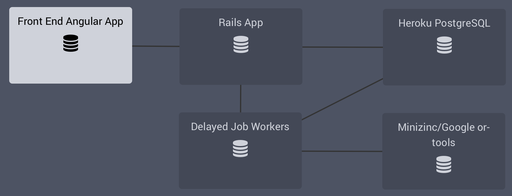
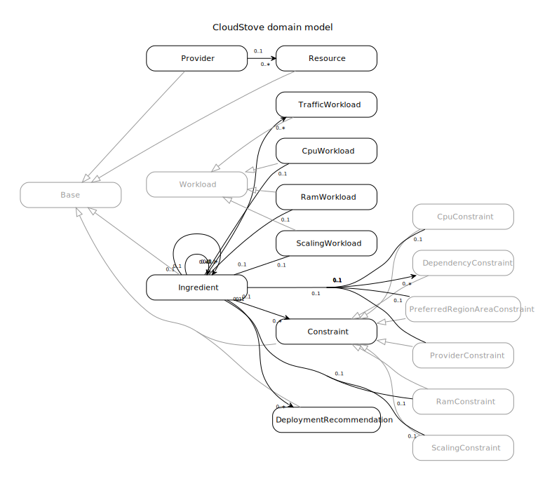
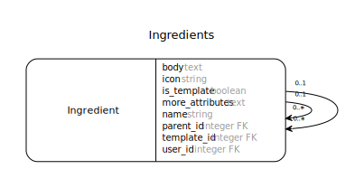
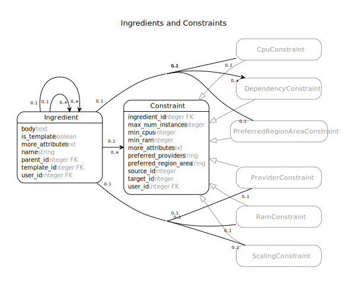
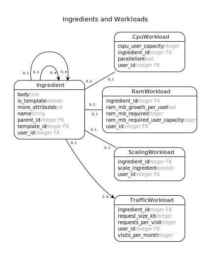
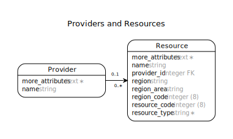

<!--
# @title Developer Guide
-->
# Cloud Stove Developer Guide

## Architecture Overview

The Cloud Stove currently consists of two main components: The backend API implemented using Ruby on Rails and the front end application implemented using AngularJS. The figure below shows a high-level overview of the Cloud Stove components (modeled using the Cloud Stove) as currently deployed:



The backend is largely a standard Rails app with ActiveRecord RDBMS data store. Recommendations are generated by transforming the modeled applications, constraints, and available provider resources into a [MiniZinc](http://www.minizinc.org) model and solving the optimal resource allocation problem using [Google or-tools](https://developers.google.com/optimization/) in asynchronously executed background jobs. 

The Angular front end is implemented in TypeScript and currently exposes most features of the backend API.

## Data Model

The figure below shows an overview of the Cloud Stove data model. Note that the {User `User`} model was omitted from the figure to reduce clutter.



All `Ingredient`, `DeploymentRecommendation`, `*Workload`, and `*Constraint` records are owned by exactly one user. By default, a user can only see and modify entities that belong to them. There is one exception, though. Template instances (discussed below) created by an admin are visible to all users.

### `Base` Model

If you need to store a lot of (semi-)structured metadata for an entity (that you don't need to query on), the `Base` model provides a `more_attributes` hash that will be serialized as a JSON object. For additional comfort, `Base` lets you define accessors for attributes stored in the serialized hash. Similar to regular attribute accessors, `ma_reader `, `ma_writer`, and `ma_accessor` will create attribute readers, writers, or both. Using accessors you can easily migrate attributes from the serialized hash to database columns when needed. When you add the column, you just need to go over all records and copy the new attribute values from the `more_attributes` hash. To use the `Base` model, inherit from `Base` and make sure that a `more_attributes` column of type `text` is part of your table.

For more information, see the documentation of {Base}.

### Ingredients



{Ingredient}s are at the core of the Cloud Stove data model. Application Templates, applications, and application components are modeled as hierarchical collections of ingredients. Application templates (or archetypes) and applications are at the root of ingredient trees, i.e., they have no parent (their `parent_id` is `nil`). Application components are linked to an application using `parent_id`. Currently, applications are flat collections of components, i.e., all components are directly assigned to one parent application. In the future, we will support reusing applications as components in other applications to create application ensembles. Templates and their components are marked by setting the `is_template` flag to `true` (The {SameIsTemplateValidator} ensures that ingredient hierarchies remain consistent).

### Constraints



All application and component properties and interactions that will later influence deployment recommendations are modeled as constraints in the Cloud Stove. As shown in the figure above, several constraint types are currently supported:

* **{DependencyConstraint}**: Component dependencies, i.e., components that communicate with each other, can be represented using dependency constraints. These component dependencies are subsequently used in combination with traffic workloads to model expected network traffic between components of an application.
* **{CpuConstraint}**: This constraint represents the minimum amount of CPU performance required for deploying the given application component. CPU performance is currently represented as the number of required "standard" CPU cores. In the future, we will migrate towards a Cloud Stove Processing Unit (CSPU) that assesses CPU performance based on automated, periodic instance benchmarks.
* **{RamConstraint}**: Similar to the CPU constraint, this constraint represents the minimum amount of RAM required (in MB) to successfully deploy the given component in production.
* **{ScalingConstraint}**: This constraint specifies the maximum number of instances this component can be distributed across. To prevent horizontal scaling for a component, set `max_num_instances` to `1` , or set it to `0` for unlimited horizontal scaling.
* **{PreferredRegionAreaConstraint}**: Deployment recommendations for applications and individual components can be constrained to certain geographical regions using this constraint. Currently, the following regions are supported: EU, US (North America), Asia-Pacific, South America. More regions will be added as providers open data centers in other regions.
* **{ProviderConstraint}**: This constraint allows you to restrict recommendations to a given set of cloud providers. The list of allowed providers is stored as a serialized array of provider ids.

Constraints are implemented as [single table inheritance (STI)](http://api.rubyonrails.org/classes/ActiveRecord/Inheritance.html).

Constraints are always attached to an ingredient. By default, a constraint applies only to the ingredient it is attached to. However, provider and region area constraints also apply all children of an ingredient.

Except for dependency constraints, there are not many reasons to directly create constraints for components. Usually, constraints are generated as part of a deployment scenario that is derived from modeled workloads.

### Workloads



Workloads are at the core of the deployment scenario analysis in the Cloud Stove. The different types of workloads provide an abstraction from concrete component constraints and allow users to specify infrastructure requirements for application components based on the requirements of a typical user of the deployed application. Several workload types are supported:

* **{CpuWorkload}**: The required CPU performance for a component is modeled with two parameters. First, the expected number of users that can be handled with one CSPU (i.e., currently one vCPU core) is specified in `cspu_user_capacity`. Additionally, the expected speedup of each additional CSPU is specified using the `parallelism` attribute.
* **{RamWorkload}**: Component memory requirements are modeled based on three parameters. We assume that a component needs a minimum amount of RAM for basic functionality (`ram_mb_required`), and that a certain number of users can be served with this base amount (`ram_mb_required_user_capacity`). Finally, the amount of memory required for each additional user is captured in `ram_mb_growth_per_user`.
* **{ScalingWorkload}**: With this basic scaling workload, components can be constrained to vertical scaling or allowed to horizontally scale across an arbitrary number of instances. Set `scale_ingredient` accordingly.
* **{TrafficWorkload}**: Using the traffic workload, users can model the expected number and size of customer requests the application should be able to serve. The three parameters represent the size of a typical application response (`request_size_kb`), the average number of customer requests per session (`requests_per_visit`), and the expected number of user sessions over a month (`visits_per_month`). We plan to use this data to generate traffic cost estimations along with deployment recommendations.

*Note:* The {Workload} base class implements common workload behavior but has no active record bindings.

### Providers and Resources



To pull in available resources from providers, the Cloud Stove uses a pluggable provider updater mechanism. Provider updaters inherit from the {ProviderUpdater} base class. The base class will dynamically load all available provider updaters in the `app/provider_updaters/` directory when {ProviderUpdater#providers} is called. To schedule background jobs executing all available updaters, call {ProviderUpdater#update_providers}.

Currently supported providers:

* {AmazonUpdater Amazon EC2}
* {GoogleUpdater Google Compute Engine}
* {AzureUpdater Microsoft Azure VMs}
* {RackspaceUpdater Rackspace Cloud Servers}
* {DigitalOceanUpdater Digital Ocean}
* {JoyentUpdater Joyent VMs}
* {AtlanticNetUpdater Atlantic.net}

Provider data update can be initiated in the provider list in the backend or using the `jobs:update_providers`  rake task.

A provider updater is a background job that initiates fetching and parsing of provider resources in `#perform`. An updater is expected to maintain a {Provider} record with a unique name that is created upon first use and subsequently updated (not re-created). Similarly, all attached {Resource}s should be created and updated to always reflect the current state of the provider offering. Provider and resource ids should remain stable.

*Note:* There is no versioning mechanism for stored provider resources. Only the current state of provider offerings should be stored. To preserve resource states when deployment recommendations are generated, recommendations store the generated MiniZinc data files on creation.

#### Resource and Region Codes

The following codes were introduced to reliably identify individual resources even when the resources have to updated (or regenerated) by the provider crawlers:

* `resource_code := deterministic_hash(resource_code, resource_name)`
* `region_code := deterministic_hash(provider_name, region_name)`

Thus, a resource is identified by the composite keys: `provider_name`, `region_name`, `resource_name`.

### Deployment Recommendations


{DeploymentRecommendation Deployment recommendations} capture resource recommendations for deploying applications (ingredient topologies). Each ingredient in an application is assumed to be deployed on a set of identical resources (cloud instances). A deployment recommendation is created for an application root instance using {Ingredient#construct_recommendations}, passing an array of target numbers of simulated users. In the regular request flow, deployment recommendations are created and computed using the {ConstructRecommendationsJob} and {EvaluateRecommendationJob} background jobs respectively.

When creating a new deployment recommendation, the current state of the application, along with resource specifications from the specified provider (or all providers if no provider id was specified) are transformed into [MiniZinc](http://minizinc.org) data files. The generated data files are then used to solve the resource assignment problem using the Cloud Stove MiniZinc model in `lib/horizontal-scaling.mzn`. Currently, the [Google or-tools](https://developers.google.com/optimization/) optimization tool set is used to solve the optimization problem.

### Using different optimizer backends
Since the Cloud Stove uses on MiniZinc to represent optimization problems, you can easily change optimization tools as long as there is a MiniZinc binding. 

To use a different optimizer, you want to add the FlatZinc interpreter binaries to the `vendor/minizinc/bin` directory, and place the included MiniZinc library files in `vendor/minizinc/share/minizinc/<interpreter-name>`. For details on how to prepare a suitable MiniZinc distribution, check out the combined [MiniZinc/or-tools distribution](https://github.com/inz/minizinc-dist) that we use for the Cloud Stove. The `release` script shows how to combine a basic MiniZinc distribution with a third party optimization tool.

To actually invoke another optimizer when generating recommendations, change the MiniZinc command in {DeploymentRecommendation#evaluate}. For instance, to generate recommendations using the included G12 optimizer, change  `command` to:

```ruby
command = "minizinc -G g12-fd #{minizinc_model} #{resources.path} #{ingredients.path}"
```

### Extending or modifying the optimization model

As mentioned above, the Cloud Stove optimization model can be found at `lib/horizontal-scaling.mzn`. If you want to change or replace this model, make sure that the structure of the `output` statement is not changed. You can change the active optimization model by modifying the path in {DeploymentRecommendation#minizinc_model}. The data files necessary for performing the optimization are generated in {DeploymentRecommendation#generate_resources_data} and {DeploymentRecommendation#generate_ingredients_data}, creating MiniZinc data representations of available provider resources and the modeled application respectively. If you change the model to expect additional parameters from the application topology, you will have to make sure to generate them in {DeploymentRecommendation#generate_ingredients_data}.

### Seed Records

To seed the database with sensible defaults, we slightly extend the Rails seeds mechanism. Since seed records for applications and application templates involve multiple dependent objects, we create complete application (and template) topologies using encapsulated seed files in `db/seeds/`. To add a new seed record, create a file in `db/seeds/` and load it in `db/seeds.rb` using `require_seed`.

To ease the creation of idempotent seed records, we provide the `ActiveRecord::Relation#seed_with!` method (available only for seeds, see `db/seeds.rb`) that will search for a seed record using the given attributes and then yield the found (or created) record to the given block. See it in use, e.g. in `db/seeds/ingredient_kanban_board.rb`.

## Serialization

JSON serialization of Rails models are defined in the `as_json` methods within the models such as:

```ruby
def as_json(options={})
  hash = super
  hash[:id] = self.id
  ...
  hash
end
```

## Authentication

Backend authentication is managed using [Devise Token Auth](https://github.com/lynndylanhurley/devise_token_auth). The front end authenticates with the backend using [Angular2-Token](https://github.com/neroniaky/angular2-token).

## API

The Cloud Stove API has a (largely) RESTful API. After authenticating against `/api/auth/sign_in` (see [Devise Token Auth](https://github.com/lynndylanhurley/devise_token_auth) documentation for details), you can access all Cloud Stove resources as described below. The reference client for the Cloud Stove API is the Cloud Stove front end AngularJS application. If in doubt, review and study API usage there.

### Resources

In general, all available resources are scoped to the currently signed in user. A valid authentication token (i.e., a `Authorization BEARER <token>` HTTP header) must be supplied with each request.

#### Ingredients

###### `GET /ingredients`

Fetch all ingredients.

* **Parameters**

  * none

* **Response**

  * A list of `ingredient`s.

* **Sample Response**

  ```json
  [
    {
      "id": 266,
      "name": "Rails Application Server",
      "icon": "server",
      "body": "The Puma application server running the Rails application.\n\n",
      "parent_id": 262,
      "created_at": "2016-12-13T13:52:58.352Z",
      "updated_at": "2016-12-13T13:52:58.352Z",
      "children": [

      ],
      "constraints": [
        {
          "id": 2012,
          "type": "DependencyConstraint",
          "ingredient_id": 266,
          "created_at": "2016-12-13T13:52:58.790Z",
          "updated_at": "2016-12-13T13:52:58.790Z",
          "target_id": 265,
          "source_id": 266
        },
        <...>
      ],
      "workloads": {
        "cpu_workload": {
          "id": 206,
          "cspu_user_capacity": 500,
          "parallelism": 0.97,
          "ingredient_id": 266
        },
        <...>
      }
    },
    <...>
  ]
  ```

###### `POST /ingredients`

Create an ingredient

* **Parameters**

  * An `ingredient` JSON object with the following structure:

    ```json
    { "ingredient": {
      "name": "<...>",
      "icon": "<... (a font-awesome icon class)>",
      "body": "<...>",
      "parent_id": <nn>,
      "<workload>_attributes": [ <workload>, <...> ],
      "<constraint>_attributes": [ <constraint>, <...> ]
    }}
    ```

* **Response**

  * `201 created` if the resource was successfully created
  * `422 unprocessable entity` if the resource could not be saved. The JSON response will contain a list of errors that prevented the resource from being saved. 

###### `GET /ingredients/:id`

Fetch an ingredient

* **Parameters**
  * `:id`: The ID of the ingredient to fetch
* **Response**
  * An `ingredient` JSON object
  * `404` if the resource with the given ID could not be found.

###### `[PATCH|PUT] /ingredients/:id`

Update an ingredient

* **Parameters**
  * An `ingredient` JSON object (see above).
* **Response**
  * `200 ok` if the resource was successfully created
  * `422 unprocessable entity` if the resource could not be saved. The JSON response will contain a list of errors that prevented the resource from being saved. 

###### `DELETE /ingredients/:id`

Delete an ingredient

* **Parameters**
  * `:id`: The ID of the ingredient to delete
* **Response**
  * `204 no content` if the resource was successfully deleted
  * `404` if the resource with the given ID could not be found.

###### `GET /ingredients/:ingredient_id/copy`

Copy an ingredient hierarchy starting at `:ingredient_id`.

* **Parameters**
  * `:ingredient_id`: The ID of the root ingredient of the hierarchy to copy
* **Response**
  * `200 ok` if the ingredient was successfully copied
  * `500` or `422 unprocessable entity` if the ingredient could not be copied

###### `GET /ingredients/:ingredient_id/template`

Convert an ingredient hierarchy into a template

* **Parameters**
  * `:ingredient_id`: The ID of the root ingredient
* **Response**
  * `200 ok` if the ingredient was successfully converted into a template
  * `500` or `422 unprocessable entity` if something went wrong

###### `GET /ingredients/:ingredient_id/instance`

Make a new instance from a template ingredient hierarchy

* **Parameters**
  * `:ingredient_id`: The ID of the template root ingredient
* **Response**
  * `200 ok` if the instance hierarchy was successfully created
  * `422 unprocessable entity` if something went wrong. 

###### `GET /ingredients/:ingredient_id/instances`

Fetch all instances of a given template ingredient

* **Parameters**
  * `:ingredient_id`: The ID of the template root ingredient
* **Returns**
  * A list of `ingredients`


##### Applications
###### `GET /applications`

Fetch all application defined by the current user

* **Parameters**

  * none

* **Response**

  * A list of `ingredient`s.

##### Templates
###### `GET /templates`

Fetch all available templates

* **Parameters**

  * none

* **Response**

  * A list of `ingredient`s.

##### Deployment Recommendations

###### `GET /ingredients/:ingredient_id/recommendations`

Fetch all recommendations for an ingredient

* **Parameters**

  * `:ingredient_id`: The ID of the root ingredient

* **Response**

  * A list of `deployment_recommendation` JSON objects

* **Sample Response**

  ```json
  [
    {
      "id": 2149,
      "vm_cost": "35.00",
      "total_cost": 35005,
      "recommendation": [
        {
          "ingredient": {
            "id": 256,
            "name": "Rails Application Server",
            "icon": "server",
            "body": "<...>",
            "parent_id": 252,
            "workloads": {
              "cpu_workload": {
                "cspu_user_capacity": 500,
                "parallelism": 0.97,
              },
              "ram_workload": {
                "ram_mb_required": 450,
                "ram_mb_required_user_capacity": 150,
                "ram_mb_growth_per_user": 0.03,
              },
              "scaling_workload": {
                "scale_ingredient": true,
              }
            }
          },
          "resource": {
            "resource_code": 742746843,
            "resource_type": "compute",
            "name": "512mb",
            "provider": "Digital Ocean",
            "cores": 1.0,
            "mem_gb": 0.5,
            "price_per_hour": 0.00744,
            "price_per_month": 5.0,
            "region": "ams1",
            "region_area": "EU",
          },
          "resource_count": "2"
        }, 
        <...>
      ],
      "num_simultaneous_users": 1000,
      "application": {
        "id": 252,
        "name": "Rails Application with PostgreSQL Backend [v4]",
        "icon": "server",
        "body": "<...>",
        "template_id": 90,
        "workloads": {
          "cpu_workload": {
            "id": 233,
            "cspu_user_capacity": 1500,
            "parallelism": 0.9,
            "ingredient_id": 252
          },
          "ram_workload": {
            "id": 233,
            "ram_mb_required": 600,
            "ram_mb_required_user_capacity": 200,
            "ram_mb_growth_per_user": 0.3,
            "ingredient_id": 252
          },
          "scaling_workload": {
            "id": 236,
            "scale_ingredient": true,
            "ingredient_id": 252
          }
        }
      },
      "status": "satisfiable"
    },
    {
      "id": 2148,
      "vm_cost": "119.26",
      "total_cost": 119273,
      "recommendation": [
        {
          "ingredient": { "id": 256, <...> },
          "resource": {
            "resource_code": 195426216,
            "resource_type": "compute",
            "name": "n1-highcpu-2",
            "provider": "Google",
            "cores": 2.0,
            "mem_gb": 1.8,
            "price_per_hour": 0.084,
            "price_per_month": 43.7472,
            "region": "europe",
            "region_area": "EU",
          },
          "resource_count": "1"
        }, 
        <...>
      ],
      "num_simultaneous_users": 1000,
      "application": { <...> },
      "status": "satisfiable"
    },
    <...>
  ]
  ```

###### `GET /ingredients/:ingredient_id/has_recommendations`

Check if recommendations exist for an ingredient

- **Parameters**
  - `:ingredient_id`: The ID of the root ingredient
- **Response**
  - `true` if recommendations exist,
  - `false` otherwise

###### `POST /ingredients/:ingredient_id/trigger_range`

Trigger generation of multiple recommendations for an ingredient. Recommendations to be generated are specified using a range.

* **Parameters**
  * `min`: The minimum number of users to generate a recommendation for
  * `max`: The maximum number of simulated uses to generate a deployment recommendation for
  * `step`: Generate recommendations for every `step` users between `min` and `max`
* **Response**
  * `job_id`: The ID of the background job calculating the recommendations.

###### `GET /ingredients/:ingredient_id/recommendations_completed`

Determine if all queued jobs to generate deployment recommendations are completed.

* **Parameters**
  * `:ingredient_id`: The ID of the root ingredient
* **Response**
  * `true` if all recommendation jobs are finished,
  * `false` otherwise

###### `DELETE /recommendations/:recommendation_id`

Delete a deployment recommendation.

- **Parameters**
  - `:recommendation_id`: The ID of the recommendation
- **Response**
  - `200` if the resource was successfully deleted
  - `404` if the resource with the given ID could not be found.

###### `DELETE /ingredients/:ingredient_id/recommendations`

Delete all deployment recommendations for an ingredient.

* **Parameters**
  * `:ingredient_id`: The ID of the root ingredient
* **Response**
  * `200` if the resource was successfully deleted
  * `404` if the resource with the given ID could not be found.

#### Workloads

##### CPU Workloads
###### `GET /cpu_workloads`

Fetch all stored CPU workloads.

- **Parameters**

  - none

- **Response**

  - A list of `cpu_workload`s.

- **Sample Response**

  ```json
  [
    {
      "id": 165,
      "cspu_user_capacity": 1500,
      "parallelism": 0.9,
      "ingredient_id": 215
    },
    <...>
  ]
  ```

###### `POST /cpu_workloads`

Create a CPU workload.

- **Parameters**

  - An `cpu_workload` JSON object with the following structure:

    ```json
    { "cpu_workload": {
      "cspu_user_capacity": <nn>,
      "parallelism": <nn>,
      "ingredient_id": <nn>,
    }}
    ```

- **Response**

  - `201 created` if the resource was successfully created
  - `422 unprocessable entity` if the resource could not be saved. The JSON response will contain a list of errors that prevented the resource from being saved. 

###### `GET /cpu_workloads/:id`

Fetch a CPU workload.

- **Parameters**
  - `:id`: The ID of the resource to fetch
- **Response**
  - A `cpu_workload` JSON object
  - `404` if the resource with the given ID could not be found.

###### `[PATCH|PUT] /cpu_workloads/:id`

Update a CPU workload.

* **Parameters**
  * A `cpu_workload` JSON object (see above).
* **Response**
  * `200 ok` if the resource was successfully created
  * `422 unprocessable entity` if the resource could not be saved. The JSON response will contain a list of errors that prevented the resource from being saved. 

###### `DELETE /cpu_workloads/:id`

Delete a CPU workload.

- **Parameters**
  - `:id`: The ID of the resource
- **Response**
  - `200` if the resource was successfully deleted
  - `404` if the resource with the given ID could not be found.

##### RAM Workloads

###### `GET /ram_workloads`

Fetch all stored RAM workloads.

- **Parameters**

  - none

- **Response**

  - A list of `ram_workload`s.

- **Sample Response**

  ```json
  [
    {
      "id": 166,
      "ram_mb_required": 600,
      "ram_mb_required_user_capacity": 200,
      "ram_mb_growth_per_user": 0.3,
      "ingredient_id": 216
    },
    <...>
  ]
  ```

###### `POST /ram_workloads`

Create a RAM workload.

- **Parameters**

  - A `ram_workload` JSON object with the following structure:

    ```json
    { "ram_workload": {
      "ram_mb_required": <nn>,
      "ram_mb_required_user_capacity": <nn>,
      "ram_mb_growth_per_user": <nn>,
      "ingredient_id": <nn>,
    }}
    ```

- **Response**

  - `201 created` if the resource was successfully created
  - `422 unprocessable entity` if the resource could not be saved. The JSON response will contain a list of errors that prevented the resource from being saved. 

###### `GET /ram_workloads/:id`

Fetch a RAM workload.

- **Parameters**
  - `:id`: The ID of the resource to fetch
- **Response**
  - A `ram_workload` JSON object
  - `404` if the resource with the given ID could not be found.

###### `[PATCH|PUT] /ram_workloads/:id`

Update a RAM workload.

* **Parameters**
  * A `ram_workload` JSON object (see above).
* **Response**
  * `200 ok` if the resource was successfully created
  * `422 unprocessable entity` if the resource could not be saved. The JSON response will contain a list of errors that prevented the resource from being saved. 

###### `DELETE /ram_workloads/:id`

Delete a RAM workload.

- **Parameters**
  - `:id`: The ID of the resource
- **Response**
  - `200` if the resource was successfully deleted
  - `404` if the resource with the given ID could not be found.

##### Traffic Workloads

###### `GET /traffic_workloads`

Fetch all stored traffic workloads.

- **Parameters**

  - none

- **Response**

  - A list of `traffic_workload`s.


###### `POST /traffic_workloads`

Create a traffic workload.

- **Parameters**

  - A `traffic_workload` JSON object with the following structure:

    ```json
    { "traffic_workload": {
      "requests_per_visit": <nn>,
      "request_size_kb": <nn>,
      "visits_per_month": <nn>,
      "ingredient_id": <nn>,
    }}
    ```

- **Response**

  - `201 created` if the resource was successfully created
  - `422 unprocessable entity` if the resource could not be saved. The JSON response will contain a list of errors that prevented the resource from being saved. 

###### `GET /traffic_workloads/:id`

Fetch a traffic workload.

- **Parameters**
  - `:id`: The ID of the resource to fetch
- **Response**
  - A `traffic_workload` JSON object
  - `404` if the resource with the given ID could not be found.

###### `[PATCH|PUT] /traffic_workloads/:id`

Update a traffic workload.

* **Parameters**
  * A `traffic_workload` JSON object (see above).
* **Response**
  * `200 ok` if the resource was successfully created
  * `422 unprocessable entity` if the resource could not be saved. The JSON response will contain a list of errors that prevented the resource from being saved. 

###### `DELETE /traffic_workloads/:id`

Delete a traffic workload.

- **Parameters**
  - `:id`: The ID of the resource
- **Response**
  - `200` if the resource was successfully deleted
  - `404` if the resource with the given ID could not be found.

##### Scaling Workloads

###### `GET /scaling_workloads`

Fetch all stored scaling workloads.

- **Parameters**

  - none

- **Response**

  - A list of `scaling_workload`s.

- **Sample Response**

  ```json
  [
    {
      "id": 236,
      "scale_ingredient": true,
      "ingredient_id": 252
    },
    <...>
  ]
  ```

###### `POST /scaling_workloads`

Create a scaling workload.

- **Parameters**

  - A `sacling_workload` JSON object with the following structure:

    ```json
    { "scaling_workload": {
      "scale_ingredient": <true|false>,
      "ingredient_id": <nn>,
    }}
    ```

- **Response**

  - `201 created` if the resource was successfully created
  - `422 unprocessable entity` if the resource could not be saved. The JSON response will contain a list of errors that prevented the resource from being saved. 

###### `GET /scaling_workloads/:id`

Fetch a scaling workload.

- **Parameters**
  - `:id`: The ID of the resource to fetch
- **Response**
  - A `scaling_workload` JSON object
  - `404` if the resource with the given ID could not be found.

###### `[PATCH|PUT] /scaling_workloads/:id`

Update a scaling workload.

* **Parameters**
  * A `scaling_workload` JSON object (see above).
* **Response**
  * `200 ok` if the resource was successfully created
  * `422 unprocessable entity` if the resource could not be saved. The JSON response will contain a list of errors that prevented the resource from being saved. 

###### `DELETE /scaling_workloads/:id`

Delete a scaling workload.

- **Parameters**
  - `:id`: The ID of the resource
- **Response**
  - `200` if the resource was successfully deleted
  - `404` if the resource with the given ID could not be found.

#### Constraints

###### `GET /constraints`

Fetch all stored constraints.

- **Parameters**

  - none

- **Response**

  - A list of `constraint`s.

- **Sample Response**

  ```json
  [
    {
      "id": 1973,
      "type": "PreferredRegionAreaConstraint",
      "ingredient_id": 252,
      "preferred_region_area": "EU"
    },
    {
      "id": 1974,
      "type": "ProviderConstraint",
      "ingredient_id": 252,
      "preferred_providers": [
        "Amazon",
        "Google",
        "Digital Ocean",
        "Microsoft Azure"
      ]
    },
    {
      "id": 1981,
      "type": "DependencyConstraint",
      "ingredient_id": 253,
      "target_id": 254,
      "source_id": 253
    },
    {
      "id": 2001,
      "type": "RamConstraint",
      "ingredient_id": 263,
      "min_ram": 504
    },
    {
      "id": 2000,
      "type": "CpuConstraint",
      "ingredient_id": 263,
      "min_cpus": 1
    },
    <...>
  ]
  ```

###### `POST /constraints`

Create a constraint.

- **Parameters**

  - A `constraint` JSON object with the following structure:

    - Dependency constraint:

      ```json
      { "constraint": {
        "type": "DependencyConstraint",
        "source_id": <nn>,
        "target_id": <nn>,
        "ingredient_id": <nn>,
      }}
      ```
    - CPU constraint:

      ```json
      { "constraint": {
        "type": "CPUConstraint",
        "min_cpus": <nn>,
        "ingredient_id": <nn>,
      }}
      ```
    - RAM constraint:

      ```json
      { "constraint": {
        "type": "RAMConstraint",
        "min_ram": <nn>,
        "ingredient_id": <nn>,
      }}
      ```
    - Provider constraint:

      ```json
      { "constraint": {
        "type": "ProviderConstraint",
        "preferred_providers": [ "Amazon", "Google", <...> ],
        "ingredient_id": <nn>,
      }}
      ```
      Retrieve available provider names using `GET /providers/names`.
    - Preferred region constraint:

      ```json
      { "constraint": {
        "type": "PreferredRegionAreaConstraint",
        "preferred_region_area": "EU",
        "ingredient_id": <nn>,
      }}
      ```
      Retrieve available region areas using `GET /resources_region_areas`.

- **Response**

  - `201 created` if the resource was successfully created
  - `422 unprocessable entity` if the resource could not be saved. The JSON response will contain a list of errors that prevented the resource from being saved. 

###### `GET /constraints/:id`

Fetch a constraint.

- **Parameters**
  - `:id`: The ID of the resource to fetch
- **Response**
  - A `constraint` JSON object
  - `404` if the resource with the given ID could not be found.

###### `[PATCH|PUT] /constraints/:id`

Update a constraint.

* **Parameters**
  * A `constraint` JSON object (see above).
* **Response**
  * `200 ok` if the resource was successfully created
  * `422 unprocessable entity` if the resource could not be saved. The JSON response will contain a list of errors that prevented the resource from being saved. 

###### `DELETE /constraints/:id`

Delete a constraint.

- **Parameters**
  - `:id`: The ID of the resource
- **Response**
  - `200` if the resource was successfully deleted
  - `404` if the resource with the given ID could not be found.

#### Providers and Resources

###### `GET /providers/names`

Fetch available cloud providers.

* **Parameters**

  * none

* **Response**

  * The list of providers that the Cloud Stove instance has pricing data for

* **Sample Response**

  ```json
  [
    "Microsoft Azure",
    "Joyent",
    "Rackspace",
    "Amazon",
    "Digital Ocean",
    "Google",
    "Atlantic.net"
  ]
  ```

###### `GET /resources_region_areas`

Fetch available region areas for deployment recommendations.

* * **Parameters**

  * none

* **Response**

  * The list of configured region areas.

* **Sample Response**

  ```json
  [
    "EU",
    "ASIA",
    "US",
    "SA"
  ]
  ```


###### `GET /resources`

Fetch all stored provider resources and their pricing data.

- **Parameters**
  - none

- **Response**
  - The list of resources that the Cloud Stove instance has pricing data for.

- **Sample Response**

  ```json
  [
    {
      "resource_code": 1804269842,
      "resource_type": "compute",
      "name": "16gb",
      "provider": "Digital Ocean",
      "cores": 8.0,
      "mem_gb": 16.0,
      "price_per_hour": 0.2381,
      "price_per_month": 160.0,
      "region": "tor1",
      "region_area": "US",
      "created_at": "2016-09-26T13:34:33.894Z",
      "updated_at": "2016-09-26T13:34:33.894Z"
    },
    {
      "resource_code": 3830277681,
      "resource_type": "compute",
      "name": "m-16gb",
      "provider": "Digital Ocean",
      "cores": 2.0,
      "mem_gb": 16.0,
      "price_per_hour": 0.17857,
      "price_per_month": 120.0,
      "region": "ams2",
      "region_area": "EU",
      "created_at": "2016-09-26T13:34:33.902Z",
      "updated_at": "2016-09-26T13:34:33.902Z"
    }
    <...>
  ]
  ```


---

Update the figures in this guide using the following command:

```shell
rake docs:update_figures
```
