<!--
# @title User Guide
-->

# User Guide

The Cloud Stove gives users deployment recommendations for their cloud applications. Application instances are derived from generic blueprints and enriched with the specific characteristics and requirements of the application to be deployed. Blueprints are generic application scaffolds that represent different application architectures to capture relevant differences in overall deployment strategies. Deployment recommendations are created by optimizing the use of available provider offerings with respect to the captured application specifications and requirements.

This user guide provides a brief overview of the current Cloud Stove features.

## Applications

After signing in, you will see a list of all applications you have modeled in the Cloud Stove. 

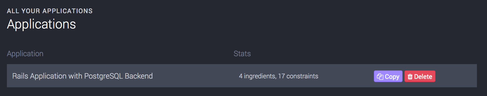

For new accounts, we create a sample Ruby on Rails application with Delayed Job for background workers and PostgreSQL as database backend.

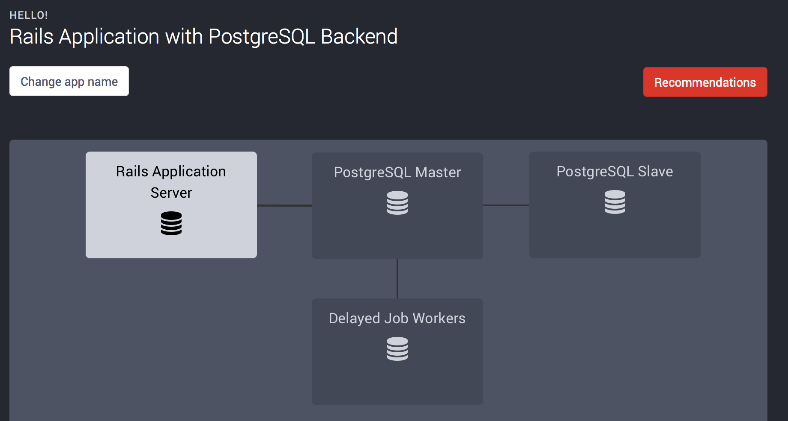

### Predefined Application Templates

The Cloud Stove comes with a number of predefined application templates so users can quickly start to generate deployment recommendations for common scenarios. Currently, there are three n-tier Web app templates available at http://app.thestove.io/templates:

* Ruby on Rails application with PostgreSQL Backend
* Python Django application with PostgreSQL Backend
* NodeJS Application with MongoDB Backend

These predefined applications include sensible default workload models. You can instantiate these applications to easily generate deployment recommendations for different scenarios.  

### Custom Applications and Application Templates

Currently, you cannot create or modify templates using the AngularJS front end. Templates can, however, be changed directly on the Rails backend. In addition to the API, the backend has an HTML interface that allows you to directly modify applications, application templates, and their composition.

You can sign in to the backend service at https://api.thestove.io using your Cloud Stove account and see all [applications](https://api.thestove.io/applications) that you have created, along with all available [templates](https://api.thestove.io/templates).

#### Customizing Applications

You can customize and configure various aspects of applications modeled with the Cloud Stove. *Note:* To preserve scenarios and recommendations generated so far, you should always create a copy of every application you want to modify.

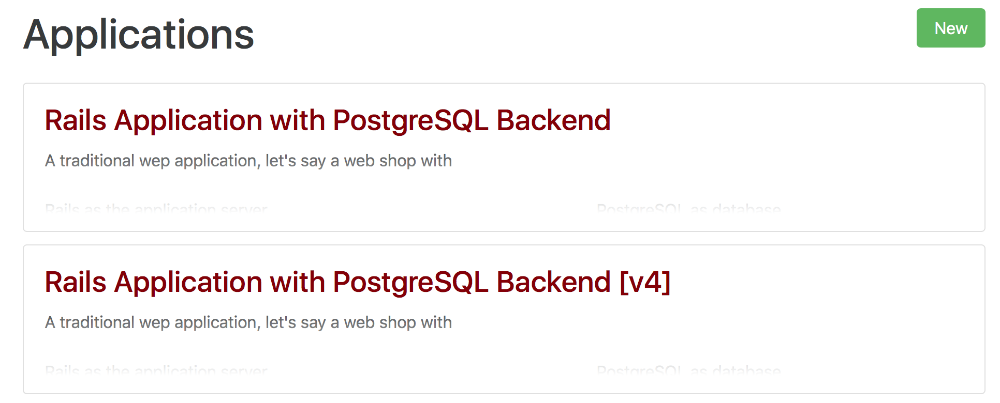

To create a copy of an existing application, find it in the [application list](https://api.thestove.io/applications), and click on the application name to navigate to the application overview. Here, you will find a helpfully labeled 'Copy' button that will create a deep copy of the shown application, including all modeled components and dependencies. The copied application will have the same name as the original application plus a "[v*n*]" suffix.

Hit 'Edit' on the bottom of the screen to modify basic application information, such as name and description.

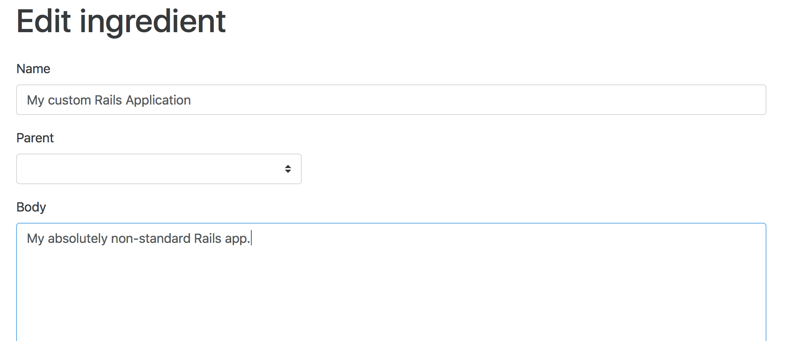

#### Adding Components to an Application

To add a component to an application, go to 'Ingredients', then 'New' in the top navigation bar or visit the [new ingredient](https://api.thestove.io/ingredients/new) form directly. Enter name and description for your new component and set 'Parent' to the application the new component should be attached to.

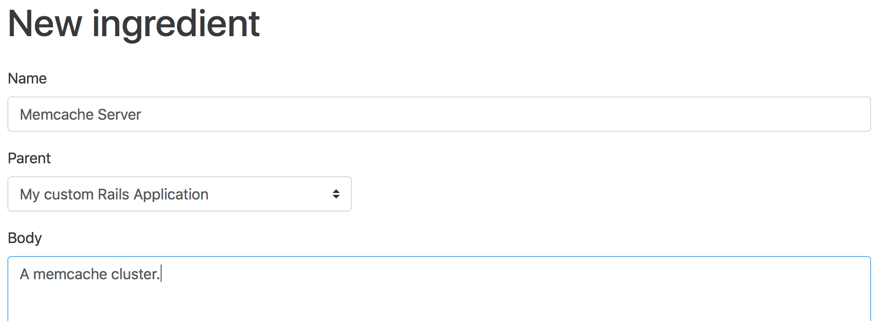

Hit 'Save' to store the new component.

#### Modifying Component Dependencies

On the application detail screen, you see an overview of currently active constraints for an application. This overview includes dependency constraints. Dependency constraints represent interactions between components of your application.

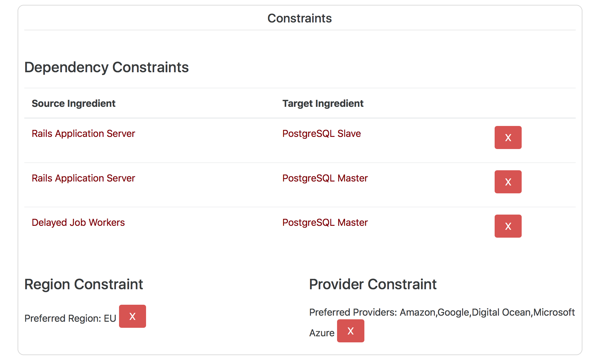

As you see in the image above, the Rails app server interacts with the database master and slave components, and the worker only interacts with the database master. 

Suppose we want to model interaction between the job worker and the database slave components. To add this interaction as a dependency constraint, click the 'Delayed Job Workers' component to show the component detail screen. Then, hit 'Edit' on the bottom of the page. On the edit form, you can see and modify all data stored about this component. Towards the bottom of the page, click the 'Add Dependency Constraint' link.

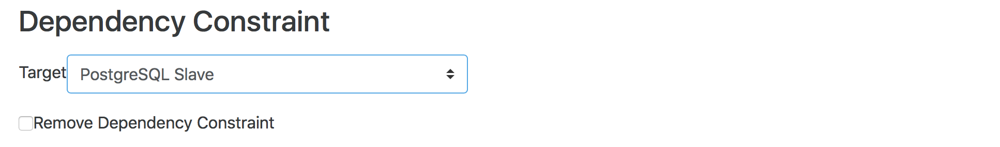

Select the desired target component from the dropdown box and hit 'Save'. You can now go back to the application overview by clicking 'Application Root' at the bottom of the page to inspect the dependency constraint you just created. 

#### Customizing Templates

Currently, regular users cannot modify templates. You can, however instantiate a template and modify the created application as described above.

## Workload Modeling

In the application detail view, you can select components in the graphical overview at the top, and adjust workload parameters to suit your application in the form below. You can adjust several parameters, such as minimum CPU and RAM required to execute the component, expected number of users that can be served with minimum CPU and RAM, required memory for each additional user, as well as a *parallelism* factor that represents how much performance gain is expected for this component when increasing the number of available CPUs.

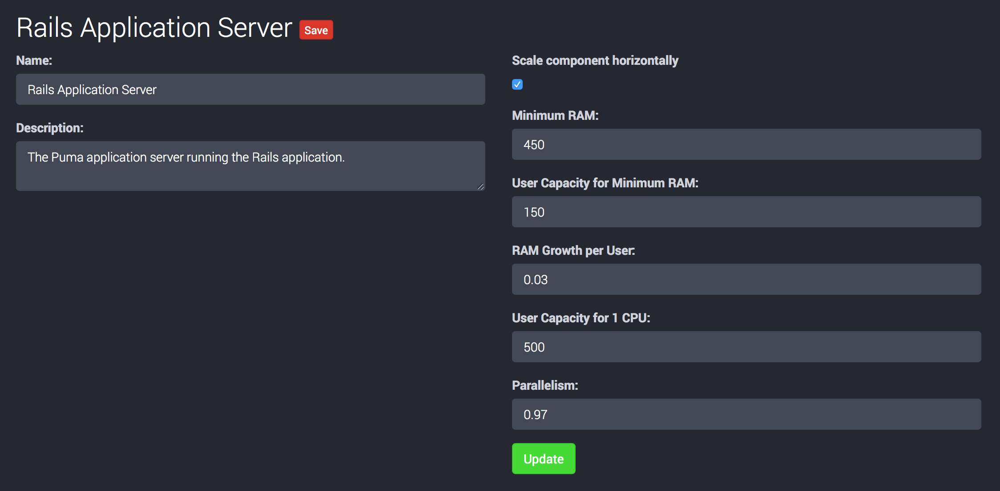

## Deployment Recommendations

Go to the *Recommendations* view by either clicking the 'Recommendations' button on the top right of the application detail view, or using the  link in the navigation panel on the left of the screen and selecting an application from the list.

At the top of the recommendations view, you see a graph with an overview of all deployment recommendations generated so far:

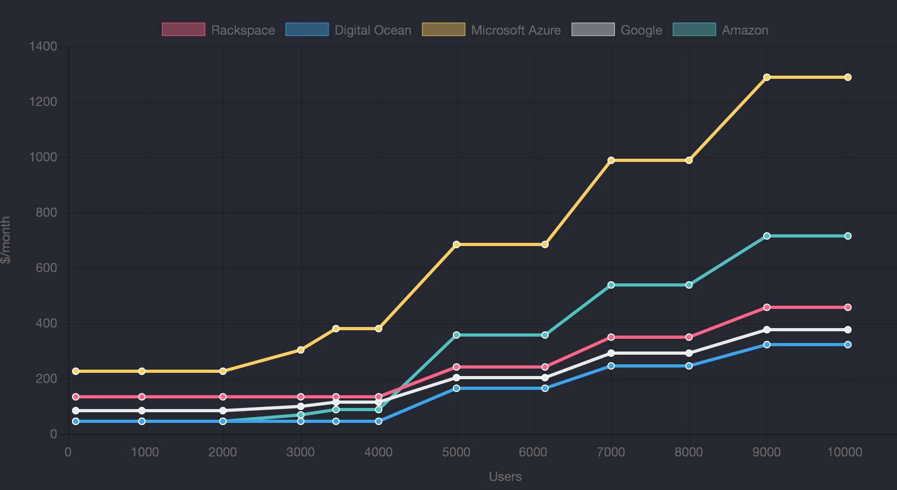

The graph will be populated with a small number of recommendations for the generated sample application. Please note that if you modified any of the workload parameter in the previous step, you might not see any recommendations yet.

Below the graph, you find the form to generate new recommendations.

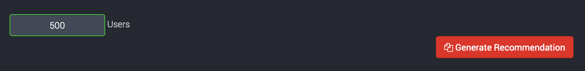

Enter the desired number of users you want to generate deployment recommendations for and hit the 'generate' button. After a couple of seconds, the new recommendations should show up in the overview graph and the recommendations list.

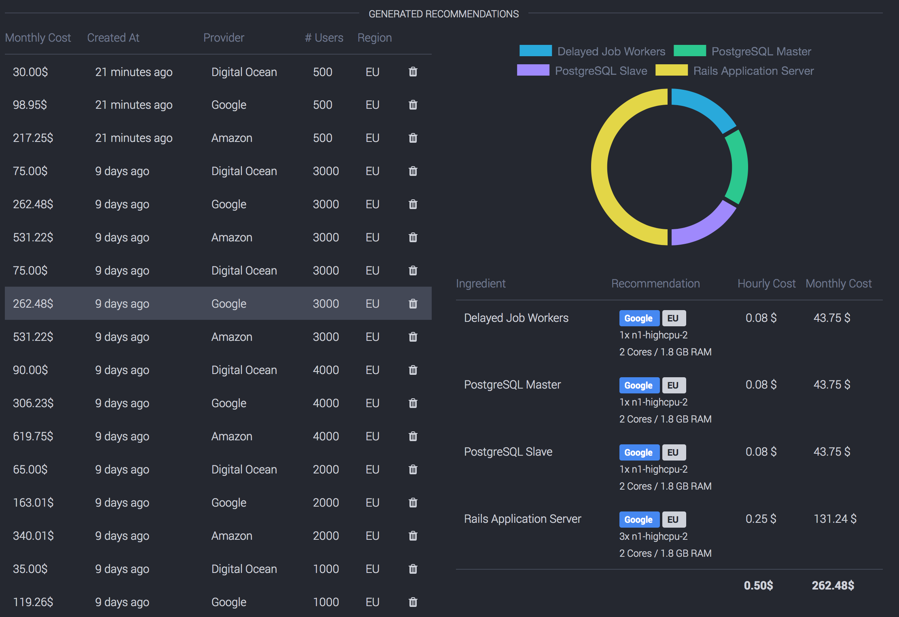

If you click on a recommendation in the list, you see a detailed description of the generated deployment recommendation next to the recommendation list (or below, depending on your browser window size). Here you can easily identify cost drivers for your application deployment and get a feel for how much each component will cost in production.
